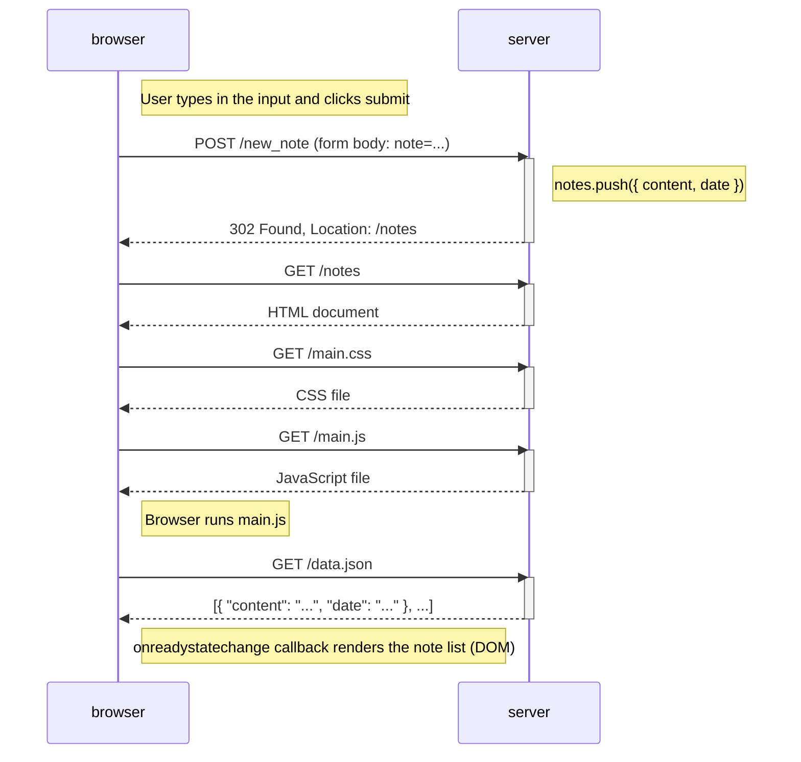

# 0.4: New note diagram (`/notes`)

Exercise 0.4 — user creates a note on https://studies.cs.helsinki.fi/exampleapp/notes (traditional form POST + full page reload).

```mermaid
sequenceDiagram
    participant browser
    participant server

    Note right of browser: User types in the input and clicks submit

    browser->>server: POST /new_note (form body: note=...)
    activate server
    Note right of server: notes.push({ content, date })
    server-->>browser: 302 Found, Location: /notes
    deactivate server

    browser->>server: GET /notes
    activate server
    server-->>browser: HTML document
    deactivate server

    browser->>server: GET /main.css
    activate server
    server-->>browser: CSS file
    deactivate server

    browser->>server: GET /main.js
    activate server
    server-->>browser: JavaScript file
    deactivate server

    Note right of browser: Browser runs main.js

    browser->>server: GET /data.json
    activate server
    server-->>browser: [{ "content": "...", "date": "..." }, ...]
    deactivate server

    Note right of browser: onreadystatechange callback renders the note list (DOM)
```
